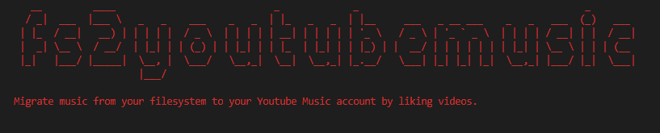

# fs2youtubemusic



Node.js CLI tool that migrates music from your filesystem to your Youtube Music account by liking videos.

**This CLI is _not really_ user-friendly, it's just a quick PoC.** Let me know if you're interested in this project.

## Requirements

- NPM
- Node.js

## Installation

This is not (yet?) published as NPM package, you need to clone the repository and run the CLI from source.

## How it works

This tool scans your music library and interactively likes videos of songs on Youtube so they will be shown in the *Liked songs* playlist on Youtube Music.

## Usage

1. Follow the steps specified at *Step 1* [here](https://developers.google.com/youtube/v3/quickstart/nodejs). The resulting JSON must be stored in the *./client_secret.json* file (in the repo's directory).
2. Run *npm link* in the repo's directory.
3. Run *fs2youtubemusic* in the repo's directory and use the option -p to specify the path yo your music directory.

```text
Usage: fs2youtubemusic [options]

Migrates music from your filesystem to your Youtube Music account by liking videos.

Options:

  -V, --version           output the version number
  -p, --path [directory]  Path to your music directory [directory]. (default: mydir)
  -h, --help              output usage information
```